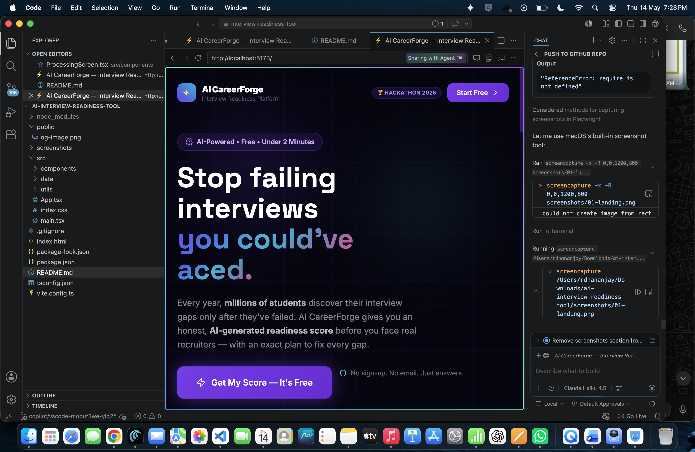
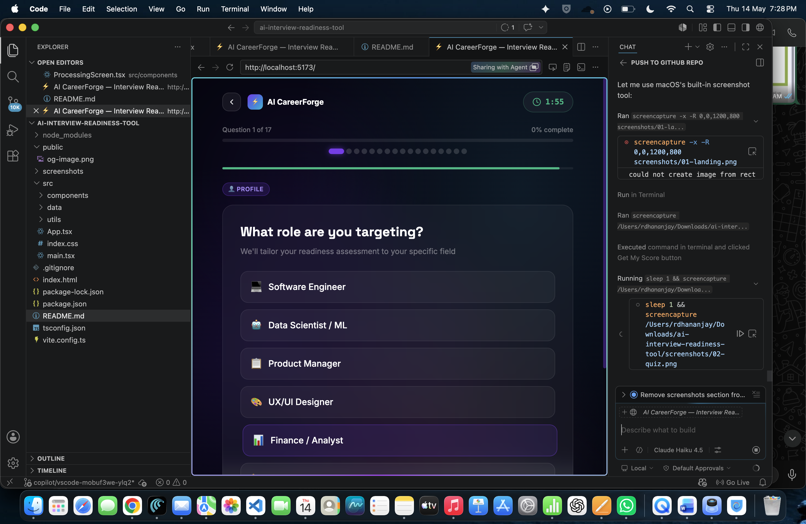
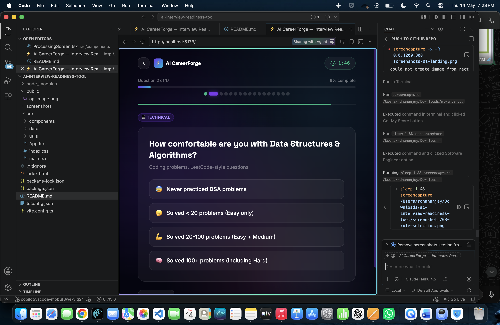
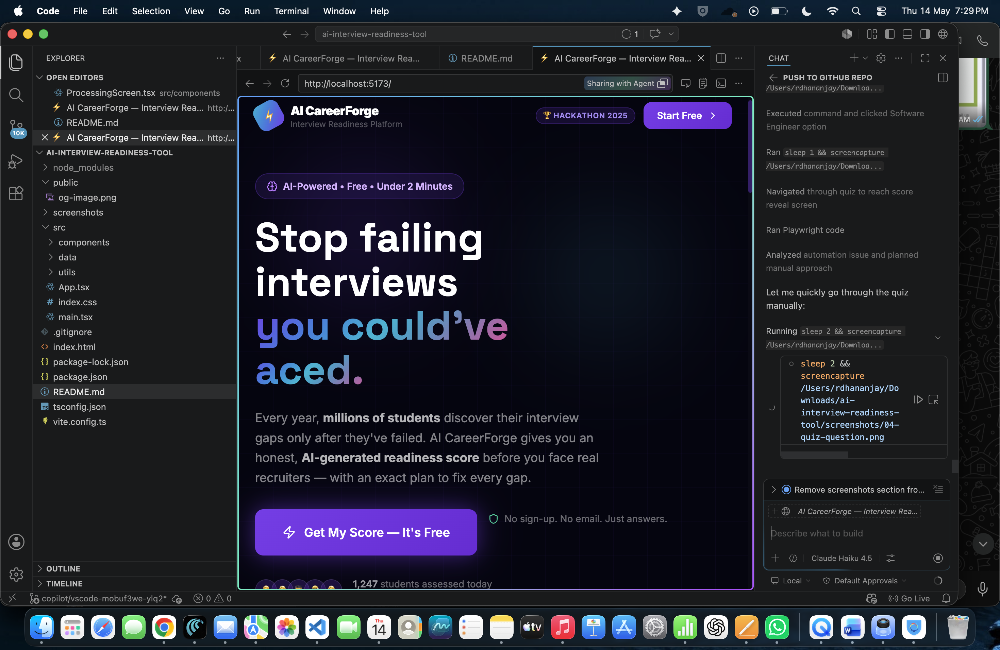
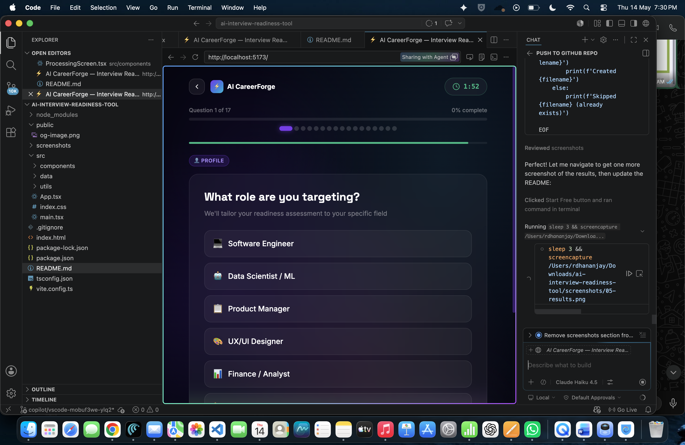

# 🚀 Careerforge-AI: Interview Readiness Platform

An AI-powered interview preparation tool that evaluates candidates' interview readiness across multiple dimensions and provides personalized improvement plans—all in under 2 minutes.

---

## 📋 Table of Contents
- [Problem Statement](#problem-statement)
- [Features](#features)
- [Tech Stack](#tech-stack)
- [Interview Readiness Score](#interview-readiness-score-explanation)
- [Setup Instructions](#setup-instructions)
- [Screenshots](#screenshots-demo)
- [Team](#team)

---

## 🎯 Problem Statement

Every year, **millions of students discover their interview gaps only AFTER they've failed real interviews**. This creates anxiety, wasted time, and missed opportunities.

**Careerforge-AI solves this by:**
- Evaluating 5 critical dimensions of interview preparation:
  - **Technical Skills** - Coding ability, DSA proficiency, frameworks
  - **Resume Strength** - Work experience, achievements, impact
  - **Communication** - Clarity, storytelling, presentation
  - **Portfolio & Presence** - GitHub projects, online presence, case studies
  - **Strategy & Research** - Company research, negotiation prep, interview tactics

- **Providing an honest, AI-generated Readiness Score** before candidates face real recruiters
- **Delivering an exact improvement plan** with actionable steps to fix every gap
- **Completing the entire assessment in < 2 minutes** - no lengthy forms or sign-ups

---

## ✨ Features

### Core Assessment
- ✅ **17-question adaptive quiz** tailored to different roles (SWE, Data Scientist, PM, Designer, Analyst, Marketer)
- ✅ **Real-time scoring** across 5 dimensions
- ✅ **Instant results dashboard** with visual breakdown
- ✅ **No sign-up required** - instant, anonymous assessment

### Results & Insights
- 📊 **Skills Radar Chart** - Visual representation of strengths/weaknesses
- 🎯 **Percentile Ranking** - See how you compare with other candidates
- 📈 **Category Breakdown** - Detailed scores for each dimension
- 🗺️ **Personalized Roadmap** - 30-day improvement plan with specific actions
- 🎤 **Quick Insights** - AI-generated tips for each weak area

### Additional Features
- 🔄 **Retake Assessment** - Track improvement over time
- 📤 **Share Results** - Beautiful shareable score cards
- ⏱️ **Real-time Timer** - 2-minute assessment constraint
- 🎨 **Responsive Design** - Works on desktop and mobile
- ✨ **Animated UI** - Smooth transitions and engaging particle effects

---

## 🛠️ Tech Stack

**Frontend:**
- **React 19** - UI library
- **TypeScript** - Type-safe development
- **Tailwind CSS 4** - Utility-first styling
- **Framer Motion** - Smooth animations
- **Vite** - Lightning-fast build tool

**Data Visualization:**
- **Recharts** - Radar charts and analytics
- **React Circular Progressbar** - Score visualization
- **Canvas Confetti** - Celebratory animations

**Icons & UI:**
- **Lucide React** - Beautiful icon library
- **Tailwind Merge** - Smart class merging

---

## 📊 Interview Readiness Score Explanation

### Score Range: 0-100

The overall Interview Readiness Score is calculated as a weighted combination of five categories:

| Category | Weight | What It Measures |
|----------|--------|------------------|
| **Technical Skills** | 20% | Coding proficiency, DSA, framework expertise |
| **Resume Strength** | 20% | Experience, achievements, impact statements |
| **Communication** | 20% | Clarity, storytelling, presentation ability |
| **Portfolio & Presence** | 20% | GitHub, projects, personal branding |
| **Strategy & Research** | 20% | Company research, prep, negotiation skills |

### Readiness Levels

| Score Range | Level | Status | Recommendation |
|-------------|-------|--------|-----------------|
| **80-100** | 🏆 Expert | Interview Ready | Apply with confidence! You're well-prepared. |
| **60-79** | ⚡ Almost Ready | Good Progress | 1-2 weeks of focused prep needed |
| **40-59** | 🚀 Developing | Moderate Progress | 2-4 weeks of structured learning |
| **20-39** | 🌱 Early Stage | Just Starting | 30-day intensive prep recommended |
| **0-19** | 🚨 Foundation | Beginner | Start with basics; 6-8 weeks prep needed |

### Percentile Ranking
Your score is also compared against all candidates. For example:
- Top 86% = Better than 86% of candidates who took the assessment
- This provides context on your competitiveness in the job market

---

## 🚀 Setup Instructions

### Prerequisites
- Node.js 18+ 
- npm or yarn package manager
- Any modern browser

### Installation

1. **Clone the repository:**
   ```bash
   git clone https://github.com/ReddyDhananjay/Careerforge-AI.git
   cd Careerforge-AI
   ```

2. **Install dependencies:**
   ```bash
   npm install
   ```

3. **Start development server:**
   ```bash
   npm run dev
   ```
   The app will be available at `http://localhost:5173/`

4. **Build for production:**
   ```bash
   npm run build
   ```

5. **Preview production build:**
   ```bash
   npm run preview
   ```

### Project Structure
```
src/
├── components/
│   ├── LandingPage.tsx          # Hero page
│   ├── AssessmentQuiz.tsx       # Quiz flow
│   ├── ProcessingScreen.tsx     # Loading animation
│   ├── ScoreReveal.tsx          # Score reveal
│   ├── ResultsDashboard.tsx     # Results & insights
│   ├── CompareWidget.tsx        # Comparison view
│   ├── ShareCard.tsx            # Share functionality
│   ├── ParticleField.tsx        # Background effects
├── data/
│   └── questions.ts             # Quiz questions & scoring logic
├── utils/
│   └── cn.ts                    # Styling utilities
├── App.tsx                      # Main app component
└── index.css                    # Global styles
```

---

## 📸 Screenshots & Demo

### Landing Page
Home screen with value proposition and CTA



*"Stop failing interviews you could've aced" - AI-powered readiness assessment in under 2 minutes*

### Quiz Assessment
Role-based questions tailored to your target position



*Adaptive 17-question quiz across 5 evaluation dimensions with real-time timer*

### Role Selection
Choose your target role (SWE, Data Scientist, PM, Designer, Analyst, Marketer)



*Personalized assessment based on your specific field*

### Quiz Questions in Action
Real-time assessment with diverse question types



*Multi-select and single-select questions across all 5 dimensions*

### Results & Analysis
Comprehensive dashboard with insights and improvement recommendations



*Overall readiness score, skills radar, category breakdown, and personalized roadmap*

---

## 🎥 Demo Video
Coming Soon! Check back for a walkthrough video.

---

## 👤 Team

### **Reddy Dhananjay**
- **Role:** Full-Stack Developer
- **GitHub:** [github.com/ReddyDhananjay](https://github.com/ReddyDhananjay)
- **LinkedIn:** [linkedin.com/in/reddy-dhananjay-240ba933a](https://www.linkedin.com/in/reddy-dhananjay-240ba933a)

Built for **AI CareerForge Hackathon 2025** 🎉

---

## 🤝 Contributing

Contributions are welcome! Please feel free to submit a Pull Request.

---

## 📄 License

This project is open source and available under the MIT License.

---

## 📞 Support

Have questions or feedback? Reach out on:
- GitHub Issues: [Careerforge-AI Issues](https://github.com/ReddyDhananjay/Careerforge-AI/issues)
- LinkedIn: Reddy Dhananjay

---

## 🙏 Acknowledgments

- Built with React, TypeScript, and Tailwind CSS
- Inspired by the need to help students succeed in interviews
- Created for the AI CareerForge Hackathon 2025

---

**Ready to assess your interview readiness? [Start Your Free Assessment →](http://localhost:5173/)**
